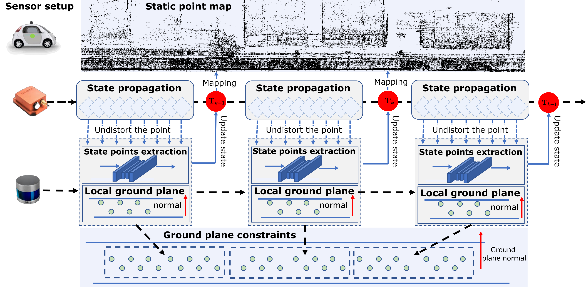

# Task-Specific-LIO

# Brief Description

This repo will contain the code for our new paper ：**Semantic-Enhanced LiDAR-Inertial Odometry for Autonomous Driving in Urban Environments**.

# Code

Comming Soon
